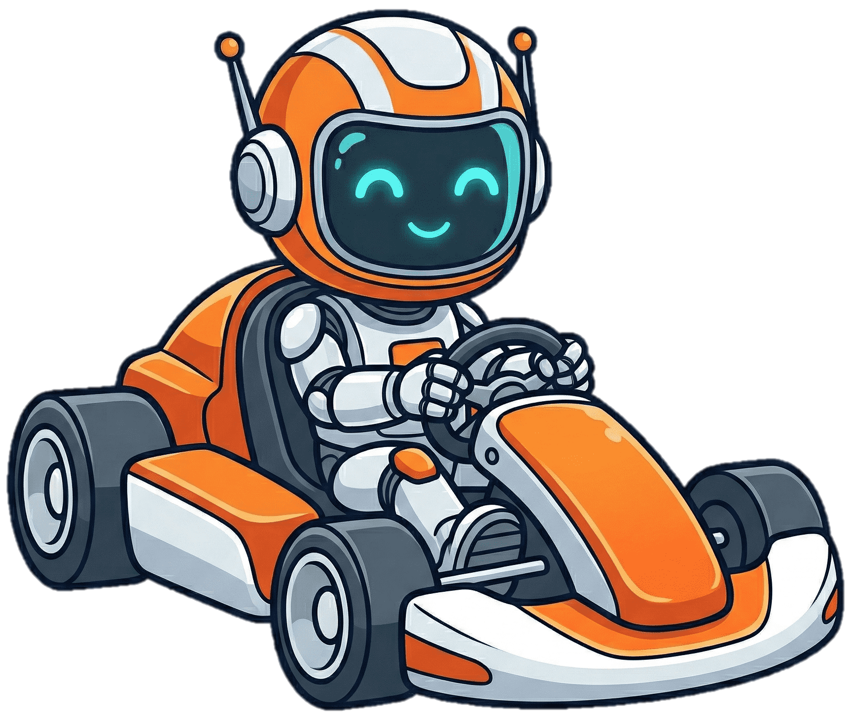
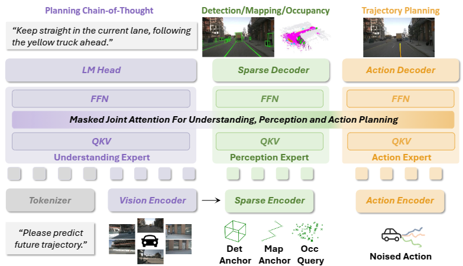

<div align="center">

<h1>UniDriveVLA</h1>
<h3>UniDriveVLA: Unifying Understanding, Perception, and Action Planning for Autonomous Driving</h3>

[Yongkang Li](https://owl-10.github.io/yongkangli/)<sup>1,2</sup>, [Lijun Zhou](https://scholar.google.com/citations?hl=en&user=RYIXvAoAAAAJ)<sup>2</sup>, [Sixu Yan](https://sixu-yan.github.io/)<sup>1</sup>, [Bencheng Liao](https://github.com/LegendBC)<sup>1</sup>,  [Tianyi Yan](https://scholar.google.com/citations?user=0JmbnNQAAAAJ&hl=en&oi=ao)<sup>2,3</sup>, [Kaixin Xiong](https://scholar.google.com/citations?user=Kh01ChoAAAAJ&hl=en&oi=ao)<sup>2</sup>, [Long Chen](https://long.ooo/)<sup>2</sup>, [Hongwei Xie](https://scholar.google.com/citations?user=kRvS9KAAAAAJ&hl=en&oi=ao)<sup>2</sup>, [Bing Wang](https://scholar.google.com/citations?user=uwTzb6IAAAAJ&hl=en&oi=sra)<sup>2</sup>, [Guang Chen](https://scholar.google.com/citations?user=yO82m38AAAAJ&hl=en)<sup>2</sup>, [Hangjun Ye](https://scholar.google.com/citations?user=68tXhe8AAAAJ)<sup>2</sup>, [Wenyu Liu](https://eic.hust.edu.cn/professor/liuwenyu/)<sup>1</sup>,  [Haiyang Sun](https://scholar.google.com/citations?hl=en&user=SYbFNsIAAAAJ)<sup>†2</sup>, [Xinggang Wang](https://xwcv.github.io/)<sup>✉1</sup>

<sup>1</sup>Huazhong University of Science and Technology &nbsp; <sup>2</sup>Xiaomi EV &nbsp; <sup>3</sup>SKL-IOTSC, University of Macau

(†) Project Leader. &nbsp; (✉) Corresponding Author.

April 3, 2026

<a href="https://arxiv.org/abs/2604.02190"></a> <a href="https://xiaomi-research.github.io/unidrivevla/"></a> <a href="https://github.com/xiaomi-research/UniDriveVLA/"></a> [](https://huggingface.co/collections/owl10/unidrivevla) [](https://huggingface.co/datasets/owl10/UniDriveVLA_Data)
</div>

---

## News

- 🔥 **[2026-04-03]** We release the paper, training/inference code, and model weights of UniDriveVLA!

## Updates
- [x] Release paper
- [x] Release code and training scripts
- [x] Release model weights on HuggingFace
- [x] Release nuScenes and Bench2Drive evaluation frameworks
- [ ] Release model on Navsim


## Table of Contents

- [News](#news)
- [Updates](#updates)
- [Table of Contents](#table-of-contents)
- [Abstract](#abstract)
- [Architecture](#architecture)
- [Getting Started](#getting-started)
  - [Data Preparation](docs/data_preparation.md)
  - [Installation](docs/installation.md)
  - [VLM Pretraining](docs/vlm_pretraining.md)
  - [Training and Evaluation on nuScenes](docs/train_eval_nuscenes.md)
  - [Training and Evaluation on Bench2Drive](docs/train_eval_bench2drive.md)
- [Checkpoints](#checkpoints)
- [Contact](#contact)
- [Acknowledgement](#acknowledgement)
- [Citation](#citation)

---

## Abstract

Vision-Language-Action (VLA) models have recently emerged in autonomous driving, with the promise of leveraging rich world knowledge to improve the cognitive capabilities of driving systems. However, adapting such models for driving tasks currently faces a critical dilemma between spatial perception and semantic reasoning. Consequently, existing VLA systems are forced into suboptimal compromises: directly adopting 2D Vision-Language Models yields limited spatial perception, whereas enhancing them with 3D spatial representations often impairs the native reasoning capacity of VLMs. We argue that this dilemma largely stems from the coupled optimization of spatial perception and semantic reasoning within shared model parameters. To overcome this, we propose **UniDriveVLA**, a **Uni**fied **Driv**ing **V**ision-**L**anguage-**A**ction model based on Mixture-of-Transformers that addresses the perception–reasoning conflict via expert decoupling. Specifically, it comprises three experts for driving understanding, scene perception, and action planning, which are coordinated through masked joint attention. In addition, we combine a sparse perception paradigm with a three-stage progressive training strategy to improve spatial perception while maintaining semantic reasoning capability. Extensive experiments show that UniDriveVLA achieves state-of-the-art performance in open-loop evaluation on nuScenes and closed-loop evaluation on Bench2Drive. Moreover, it demonstrates strong performance across a broad range of perception, prediction, and understanding tasks, including 3D detection, online mapping, motion forecasting, and driving-oriented VQA, highlighting its broad applicability as a unified model for autonomous driving.

---

## Architecture

<div align="center">

</div>

UniDriveVLA adopts a **Mixture-of-Transformers** architecture with three specialized experts:
- **Understanding Expert**: Leverages a pre-trained 2D VLM (Qwen3-VL) for semantic scene comprehension and driving QA
- **Perception Expert**: Introduce sparse perception that extracts spatial priors from 2D VLM features, supporting detection, mapping, occupancy, and motion forecasting
- **Planning Expert**: Fuses VLM semantic features and spatial perception features to generate safe, precise trajectories

---

## Getting Started

- [Data Preparation](docs/data_preparation.md)
- [Installation](docs/installation.md)
- [VLM Pretraining](docs/vlm_pretraining.md)
- [Training and Evaluation on nuScenes](docs/train_eval_nuscenes.md)
- [Training and Evaluation on Bench2Drive](docs/train_eval_bench2drive.md)

---

## Checkpoints

> nuScenes Open-Loop Results (ST-P3 metrics, without ego status)

| Method | Backbone | L2@1s ↓ | L2@2s ↓ | L2@3s ↓ | Avg. L2 ↓ | Col@1s ↓ | Col@2s ↓ | Col@3s ↓ | Avg. Col ↓ | Config | Weights |
|:---:|:---:|:---:|:---:|:---:|:---:|:---:|:---:|:---:|:---:|:---:|:---:|
| UniDriveVLA-Base | Qwen3-VL-2B | 0.28 | 0.51 | 0.82 | 0.54 | 0.08 | 0.13 | 0.31 | 0.17 | [config](nuScenes/projects/configs/UniDriveVLA/unidrivevla_stage2_2b.py) | [HuggingFace](https://huggingface.co/owl10/UniDriveVLA_Nusc_Base_Stage3) |
| UniDriveVLA-Large | Qwen3-VL-8B | 0.27 | 0.49 | 0.77 | 0.51 | 0.03 | 0.10 | 0.21 | 0.11 | [config](nuScenes/projects/configs/UniDriveVLA/unidrivevla_stage2_8b.py) | [HuggingFace](https://huggingface.co/owl10/UniDriveVLA_Nusc_Large_Stage3) |

> Bench2Drive Closed-Loop Results

<table style="border-collapse: collapse; text-align: center; width: 100%;">
  <caption><b>Closed-loop and Multi-ability Testing Results in CARLA Bench2Drive</b></caption>
  <thead>
    <tr>
      <th rowspan="2">Method</th>
      <th colspan="4">Closed-loop Metric ↑</th>
      <th colspan="6">Multi-Ability Test (%) ↑</th>
    </tr>
    <tr>
      <th>DS</th>
      <th>Success</th>
      <th>Efficiency</th>
      <th>Comfort</th>
      <th>Merging</th>
      <th>Overtaking</th>
      <th>Emerg. Brake</th>
      <th>GiveWay</th>
      <th>Traf. Sign</th>
      <th>Mean</th>
    </tr>
  </thead>
  <tbody>
    <tr>
      <td><b>UniDriveVLA</b> (<a href="https://huggingface.co/owl10/UniDriveVLA_B2D_Base_Stage3">weights</a>)</td>
      <td>78.37</td>
      <td>51.82</td>
      <td>198.86</td>
      <td>11.78</td>
      <td>38.75</td>
      <td>80.00</td>
      <td>50.00</td>
      <td>30.00</td>
      <td>58.95</td>
      <td>51.53</td>
    </tr>
  </tbody>
</table>

> Perception Results on nuScenes val

| Method | Det NDS ↑ | Det mAP ↑ | Map mAP ↑ | Weights |
|:---:|:---:|:---:|:---:|:---:|
| UniDriveVLA-Base | 0.434 | 0.397 | 0.520 | [HuggingFace](https://huggingface.co/owl10/UniDriveVLA_Nusc_Base_Stage3) |
| UniDriveVLA-Large | 0.460 | 0.407 | 0.535 | [HuggingFace](https://huggingface.co/owl10/UniDriveVLA_Nusc_Large_Stage3) |

> All Model Weights (Stage 1 & 2 are intermediate checkpoints for progressive training; Stage 3 is the final model)

| Model | HuggingFace |
|:---:|:---:|
| UniDriveVLA-Base (nuScenes) Stage 1 | [owl10/UniDriveVLA_Nusc_Base_Stage1](https://huggingface.co/owl10/UniDriveVLA_Nusc_Base_Stage1) |
| UniDriveVLA-Base (nuScenes) Stage 2 | [owl10/UniDriveVLA_Nusc_Base_Stage2](https://huggingface.co/owl10/UniDriveVLA_Nusc_Base_Stage2) |
| UniDriveVLA-Base (nuScenes) **Stage 3** | [owl10/UniDriveVLA_Nusc_Base_Stage3](https://huggingface.co/owl10/UniDriveVLA_Nusc_Base_Stage3) |
| UniDriveVLA-Large (nuScenes) Stage 1 | [owl10/UniDriveVLA_Nusc_Large_Stage1](https://huggingface.co/owl10/UniDriveVLA_Nusc_Large_Stage1) |
| UniDriveVLA-Large (nuScenes) Stage 2 | [owl10/UniDriveVLA_Nusc_Large_Stage2](https://huggingface.co/owl10/UniDriveVLA_Nusc_Large_Stage2) |
| UniDriveVLA-Large (nuScenes) **Stage 3** | [owl10/UniDriveVLA_Nusc_Large_Stage3](https://huggingface.co/owl10/UniDriveVLA_Nusc_Large_Stage3) |
| UniDriveVLA-Base (Bench2Drive) Stage 1 | [owl10/UniDriveVLA_B2D_Base_Stage1](https://huggingface.co/owl10/UniDriveVLA_B2D_Base_Stage1) |
| UniDriveVLA-Base (Bench2Drive) Stage 2 | [owl10/UniDriveVLA_B2D_Base_Stage2](https://huggingface.co/owl10/UniDriveVLA_B2D_Base_Stage2) |
| UniDriveVLA-Base (Bench2Drive) **Stage 3** | [owl10/UniDriveVLA_B2D_Base_Stage3](https://huggingface.co/owl10/UniDriveVLA_B2D_Base_Stage3) |

---

## Contact

If you have any questions, please contact [Yongkang Li](https://owl-10.github.io/yongkangli/) via email (liyk@hust.edu.cn).

---

## Acknowledgement

UniDriveVLA is built upon the following outstanding open-source works:

- [Openpi](https://github.com/Physical-Intelligence/openpi) — VLA training framework
- [InternVLA-A1](https://github.com/InternRobotics/InternVLA-A1) — VLA model for robotic manipulation
- [HiP-AD](https://github.com/nullmax-vision/HiP-AD) — Hierarchical planning for autonomous driving
- [SparseDrive](https://github.com/swc-17/SparseDrive) — Sparse 3D perception framework for autonomous driving
- [Bench2Drive](https://github.com/Thinklab-SJTU/Bench2Drive) — Closed-loop evaluation in CARLA
  

---

## Citation

If you find UniDriveVLA useful in your research or applications, please consider giving us a star 🌟 and citing it by the following BibTeX entry:

```bibtex
@article{li2026unidrivevla,
  title={UniDriveVLA: Unifying Understanding, Perception, and Action Planning for Autonomous Driving},
  author={Li, Yongkang and Zhou, Lijun and Yan, Sixu and Liao, Bencheng and Yan, Tianyi and Xiong, Kaixin and Chen, Long and Xie, Hongwei and Wang, Bing and Chen, Guang and Ye, Hangjun and Sun, Haiyang and Liu, Wenyu and Wang, Xinggang},
  journal={arXiv preprint arXiv:2604.02190},
  year={2026}
}
```
